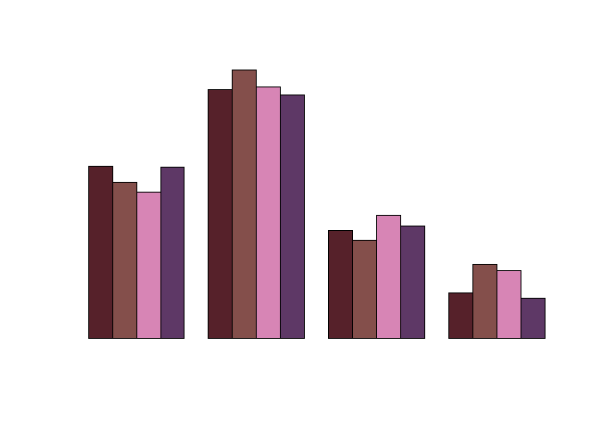
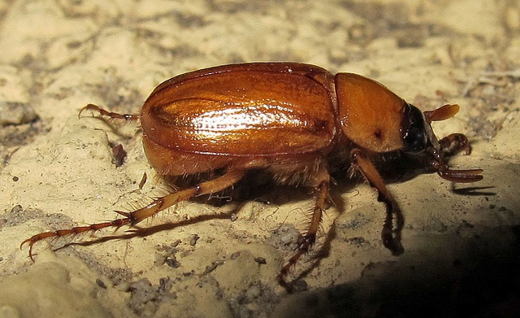
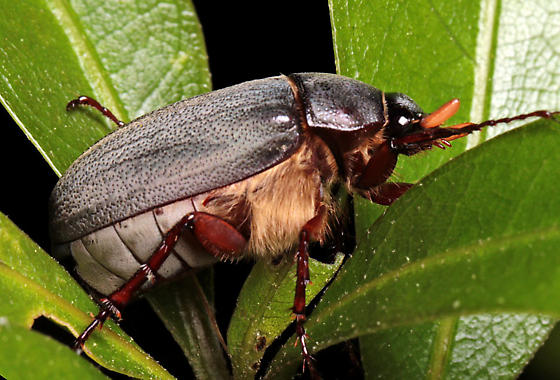
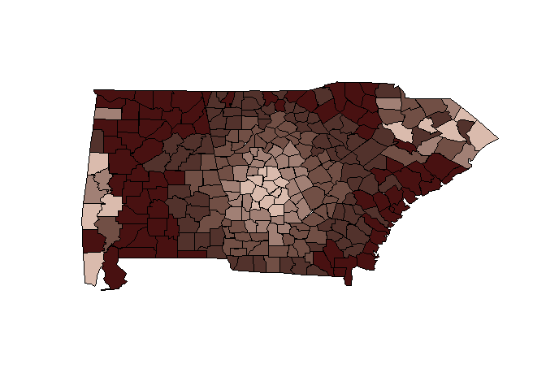
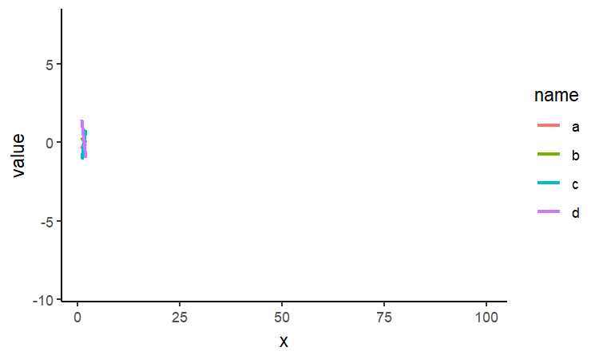
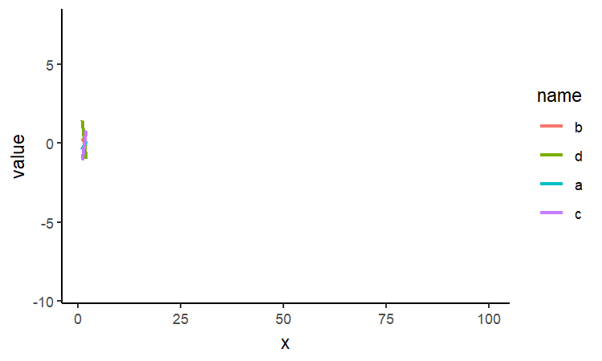

-   [`junebug` Package](#junebug-package)
    -   [Installation and usage](#installation-and-usage)
-   [Highlights](#highlights)
    -   [Palettes](#palettes)
    -   [`ggsave_auto()` - Accumulate multiple versions of a
        plot](#ggsave_auto---accumulate-multiple-versions-of-a-plot)
    -   [`split_track()` - Track groups individually over a region of
        time](#split_track---track-groups-individually-over-a-region-of-time)
    -   [`col_dummy()` - Add dummy coded variables as
        columns](#col_dummy---add-dummy-coded-variables-as-columns)

`junebug` Package
=================

A hodge-podge of functions for various uses, from interactive debugging
to preparing data for modeling. The name of the package comes from my
nickname and also reflects my early fascination for insects, which has
actually [contributed to my passion in data
visualization](https://yjunechoe.github.io/posts/2020-10-13-designing-guiding-aesthetics/).

To some extent, this package was made for personal use, so keep in mind
that it’s currently not designed to be light on dependencies.

Installation and usage
----------------------

    devtools::install_github("yjunechoe/junebug")

When using `{junebug}`, is highly recommended to also load the
`{tidyverse}` set of packages (specifically, `{dplyr}`, `{tibble}`,
`{purrr}`, `{tidyr}`, `{ggplot2}`, `{stringr}`).

    library(junebug)
    # install.packages("tidyverse")
    library(tidyverse)

Depending on the function being used, `{junebug}` may require packages
other than the tidyverse packages to also be loaded (details below).

Highlights
==========

Some functions/capabilities of `{junebug}`

Palettes
--------

Color palettes inspired by beetles of the genus *phyllophaga*, more
commonly known as **June Bugs** or **June Beetles**.

### CranberryWhiteGrub

### CubanMay

### Mican

`ggsave_auto()` - Accumulate multiple versions of a plot
--------------------------------------------------------

**depends**: packages `{ggplot2}` and `{magick}`

`ggsave_auto()` is a wrapper around `ggplot2::ggsave()`. By default, it
creates a new folder named “ggsaveauto\_img” and saves the last plot
printed to “img\_001.png”, “img\_002.png”, etc. It also has an option
(enabled by default) to load the most recently saved plot into view
using the system default app.

The follow code saves the plot to “ggsaveauto\_img/img\_001.png” with
`width = 20`, `height = 12`, and `unit = 'cm'`.

    ggplot(mtcars, aes(hp, mpg)) +
      geom_point(color = 'red')

    ggsave_auto()

Calling `ggsave_auto()` again after printing a second plot saves the
plot to “ggsaveauto\_img/img\_002.png”

    ggplot(mtcars, aes(hp, mpg)) +
      geom_point(color = 'blue')

    ggsave_auto()

Names of path and image files can be customized using the following
arguments: `folder`, `n_pad`, `padding`, `img_prefix`, and `img_ext`.

To turn off the automatic loading of the saved plot, set
`plot_load = "none"`. Alternatively, to load the saved plot into view
inside RStudio, use `plot_load = "rstudio"` (but not recommended for
quality issues).

`split_track()` - Track groups individually over a region of time
-----------------------------------------------------------------

**depends**: package `{rlang}`

`split_track()` is a helper function for `{gganimate}`, designed for use
with the `transition_reveal()` engine.

`split_track()` can be used for a special case of plotting *change in a
variable (y-axis) over time (x-axis)* (e.g., line graphs), where you
have multiple groups and want to track them individually over a region.

For example, say we have this following data about four groups (`name`)
whose `value` changes over `time` (ranging from 1 to 100).

    set.seed(123)

    plot_df <- tibble(
      a = cumsum(runif(100, -1, 1)),
      b = cumsum(runif(100, -1.5, 1.5)),
      c = cumsum(runif(100, -2, 2)),
      d = cumsum(runif(100, -2.5, 2.5))
    ) %>% pivot_longer(a:d) %>%
      group_by(name) %>%
      mutate(reveal_time = row_number(), x = row_number()) %>%
      ungroup()

    plot_df

    ## # A tibble: 400 x 4
    ##    name    value reveal_time     x
    ##    <chr>   <dbl>       <int> <int>
    ##  1 a     -0.425            1     1
    ##  2 b      0.300            1     1
    ##  3 c     -1.05             1     1
    ##  4 d      1.42             1     1
    ##  5 a      0.152            2     2
    ##  6 b     -0.202            2     2
    ##  7 c      0.804            2     2
    ##  8 d     -1.03             2     2
    ##  9 a     -0.0303           3     3
    ## 10 b     -0.236            3     3
    ## # ... with 390 more rows

With this data, `transition_reveal()` would animate the trajcetory of
all groups simultaneously. If we want to track each group individually
over a region (say, where `x` is greater than or equal to `75`), we can
do the following:

    library(gganimate)

    split_anim1 <- plot_df %>%
      split_track(grouping_var = name, tracked_along = reveal_time, x >= 75) %>%
      ggplot(aes(x, value, color = name)) +
      geom_line(size = 1) +
      transition_reveal(reveal_time) +
      theme_classic()

    animate(split_anim1, width = 5, height = 3, units = "in", nframes = 50, res = 150)

You can also specify which groups get tracked individually, using the
`tracked_groups` argument. In the following code, we also change the
grouping variable to a `factor` and specify the ordering of the levels
to make sure that the lines that are revealed later are drawn over lines
that are revealed earlier.

    split_anim2 <- plot_df %>%
      split_track(grouping_var = name, tracked_along = reveal_time, x >= 75, tracked_groups = c('a', 'c')) %>%
      mutate(name = factor(name, levels = c("b", "d", "a", "c"))) %>% # reordering between groups
      ggplot(aes(x, value, color = name)) +
      geom_line(size = 1) +
      transition_reveal(reveal_time) +
      theme_classic()

    animate(split_anim2, width = 5, height = 3, units = "in", nframes = 50, res = 150)

`col_dummy()` - Add dummy coded variables as columns
----------------------------------------------------

**depends**: package `{data.table}`

Given a column containing `n` distinct levels, `col_dummy()` produces
`n-1` new columns that treatment code each level except the reference
level. This explicit coding is necessary for some packages which do not
work with implicit coding in R’s `factor` data type (e.g., the
`{lavaan}` package for structural equation modeling)

    levels(iris$Species)

    ## [1] "setosa"     "versicolor" "virginica"

    iris %>% 
      col_dummy(Species, reference = "virginica") %>% 
      head()

    ## The reference level of 'Species' is 'virginica'

    ##   Sepal.Length Sepal.Width Petal.Length Petal.Width Speciessetosa
    ## 1          5.1         3.5          1.4         0.2             1
    ## 2          4.9         3.0          1.4         0.2             1
    ## 3          4.7         3.2          1.3         0.2             1
    ## 4          4.6         3.1          1.5         0.2             1
    ## 5          5.0         3.6          1.4         0.2             1
    ## 6          5.4         3.9          1.7         0.4             1
    ##   Speciesversicolor
    ## 1                 0
    ## 2                 0
    ## 3                 0
    ## 4                 0
    ## 5                 0
    ## 6                 0

Note that the model output is the same:

    lm(Sepal.Length ~ Species, data = iris) # implicit coding

    ## 
    ## Call:
    ## lm(formula = Sepal.Length ~ Species, data = iris)
    ## 
    ## Coefficients:
    ##       (Intercept)  Speciesversicolor   Speciesvirginica  
    ##             5.006              0.930              1.582

    lm(Sepal.Length ~ Speciesversicolor + Speciesvirginica, data = col_dummy(iris, Species)) # explicit coding

    ## The reference level of 'Species' is 'setosa'

    ## 
    ## Call:
    ## lm(formula = Sepal.Length ~ Speciesversicolor + Speciesvirginica, 
    ##     data = col_dummy(iris, Species))
    ## 
    ## Coefficients:
    ##       (Intercept)  Speciesversicolor   Speciesvirginica  
    ##             5.006              0.930              1.582

`col_dummy()` is similar to `psych::dummy.code()`, except that
`col_dummy()` creates `n-1` variables and directly adds the new
variables as columns in the data instead of returning a matrix.
