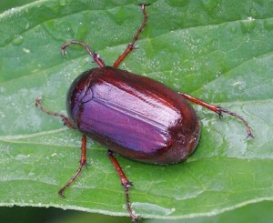
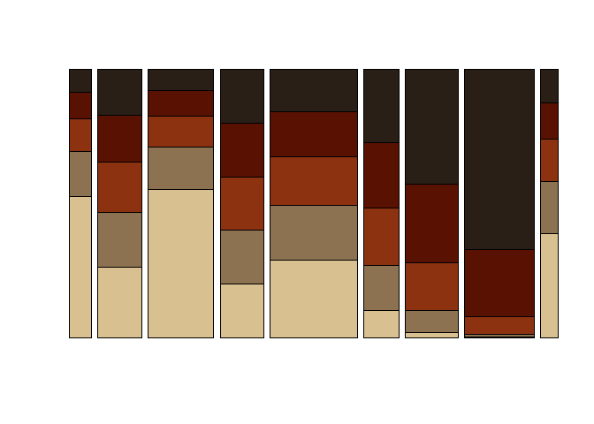

`junebug` Package
-----------------

A hodge-podge of functions for various uses, from interactive debugging
to preparing data for modeling. The name of the package comes from my
nickname and also reflects my early fascination for insects, which has
actually [contributed to my passion in data
visualization](https://yjunechoe.github.io/posts/2020-10-13-designing-guiding-aesthetics/).

To some extent, this package was made for personal use, so keep in mind
that it’s currently not designed to be light on dependencies.

Installation
------------

    devtools::install_github("yjunechoe/junebug")

Usage
-----

    library(junebug)

Palettes
--------

Color palettes inspired by beetles of the genus *phyllophaga*, more
commonly known as **June Bugs** or **June Beetles**.

### CranberryWhiteGrub

### CubanMay

### Mican

